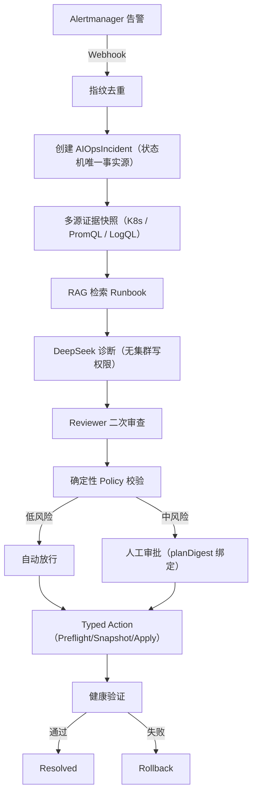

把大模型的自然语言输出直接喂给 `kubectl` 做自动修复，听起来很诱人，却有三个靠「多试几次提示词」解决不了的问题：模型不该有集群写权限、自然语言不可执行也不可审计、幻觉是结构性的而不是调参能消除的。

**AegisOps** 的定位是一个**面向生产约束的工程实验平台**，核心原则只有一句话：**建议权与执行权分离**。DeepSeek 只负责基于证据提出可被机器校验的候选方案，本身没有 kubeconfig；集群写操作只能经过 Operator 的固定类型化动作，中间隔着确定性策略、方案摘要哈希审批与健康验证。需要先说清楚：本项目目前**不宣称生产可用**，它是一套可以解释、审批、回滚和审计的可靠性控制面，不是已经可以替你值班的系统。

下面不按「功能列表」讲，而是沿着**一次真实的 OOM 事故**走一遍完整链路，说明这套设计到底解决了什么、又在哪里还做不到。

---

## 一次 OOM 事故的完整处置

集群里的 `fault-lab` 部署被注入 OOM 故障，容器因 `OOMKilled` 退出。这恰好对应 `fault-lab/imagepullbackoff` 那类案例——从告警到恢复的每一步，都对应一个明确的设计取舍。



### 1. 告警接入与去重

Alertmanager 把 `ContainerOOMKilled` 告警推到 AegisOps 的 Webhook。Gateway 做指纹去重，把「同一个故障反复告警」收敛成一个事故，避免控制循环被重复触发。


_图 1：Grafana「AegisOps 事故响应总览」面板。这是采集时刻的一次快照，活跃 Incident 为 0，不代表持续运行期间的告警状态。_

### 2. 证据采集：结论必须挂在证据上

事故进入 `CollectingEvidence` 后，Operator 采集多源证据快照：`ContainerState`、`PodState`、`KubernetesEvent`、`RolloutDiff`。诊断卡给出的方案是 `RollbackDeployment {targetRevision:3}`，`confidence=0.9`——每个结论都要能回溯到某条证据。


_图 2：事故详情页的证据条目与诊断卡。诊断由 fake 确定性 provider 输出，仅用于验证「证据 → 诊断 → 方案」的链路，不代表真实模型效果。_

### 3. 模型哪里会错，为什么需要 reviewer

这里是最反直觉的部分。DeepSeek 基于证据产出的候选方案，**在没有二次审查时会漏过危险动作**——后面的真实评估一节会给出具体数字。所以方案在进入策略校验前，先经过一层确定性 reviewer。

### 4. 中风险动作必须人工审批

`PatchResourceLimit` 属于中风险动作，策略判定 `ApprovalRequired`。审批弹窗展示动作、参数 `{"targetRevision":3}` 与 `planDigest` 前缀。审批绑定的是**不可复用的方案摘要**——方案、目标对象或策略版本任何一处变化，旧审批都会自动失效。


_图 3：中风险动作的审批弹窗。审批绑定 planDigest，一次审批只覆盖一个确定的方案。_

### 5. 类型化执行与健康验证

审批通过后进入执行：`Preflight → Snapshot → Apply`，随后是健康验证。时间线从 `Detected` 一路走到 `Executing → Verifying → Resolved`，审计链记录 `ApprovalGranted → ExecutionStarted → ExecutionCompleted → IncidentResolved`。


_图 4：一次 fake 诊断闭环从执行、验证到 Resolved 的完整时间线。该链路验证了控制面的编排能力，不构成真实 AI 修复证明。_

### 6. 失败回滚与审计哈希链

验证失败时会回滚到候选 revision。审计事件带 `sequence` 与 `eventHash`，形成连续哈希链，actor 为 `operator` 与脱敏后的 `token-<hex16>`。


_图 5：回滚与审计链时间线卡。审计事件带序列号与事件哈希，形成连续哈希链，用于事后追溯。_

到这里，一次事故的处置闭环走完了。告警邮件、跨组件追踪属于旁路佐证，各放一张：


_图 6：本地 MailHog 收到的 FIRING 告警邮件。收件人/发件人为占位地址并已黑条覆盖，这是本地 SMTP smoke，不是真实生产邮件闭环。_


_图 7：同一告警的 RESOLVED 恢复邮件。真实 SMTP（smtp.qq.com:587）另行 smoke 验证过 delivered=2、failed=0。_


_图 8：同一 trace 内包含 Operator 与 Diagnosis API 的跨组件 span，验证了 OpenTelemetry 追踪链路贯通。_

---

## 事实源：CR 是控制循环的唯一事实源，不是「完整事故链」

有一点需要把话说准：`AIOpsIncident` 是**控制循环状态的唯一事实源**，但**不是「完整事故链」的完整存储**。CR 保存的是状态机当前态、方案摘要、引用与最近 20 条时间线；完整证据包、执行快照和审计事件在 PostgreSQL 里。所以准确表述是：

> **AIOpsIncident 是控制循环状态的唯一事实源；完整证据与审计档案，由 CR 引用的 PostgreSQL 记录共同组成。**

这正是一个架构取舍：CR 保持轻量、能被 kubectl 快速观察，重数据（证据包、审计链、执行快照）落到 PostgreSQL，CR 只持有引用。

---

## 安全边界是头等设计，不是附加项

这套架构最重要的承诺是边界清晰，而非「AI 有多聪明」：

- **DeepSeek 无任何 Kubernetes 写权限**，Operator 也无 DeepSeek Key，两者凭据彻底隔离。
- **禁止模型生成或执行任意 Shell、kubectl、通用 Patch**，模型只能产出满足 JSON Schema 的候选方案。
- **全部写操作映射到固定的 5 个类型化动作**：`RestartWorkload`、`ScaleDeployment`、`PatchResourceLimit`、`RollbackDeployment`、`RestoreConfigMap`。每个动作都实现 Preflight、Snapshot、Apply、Verify、Rollback。
- **中风险动作必须人工审批**，审批绑定 `planDigest`（内含目标 resourceVersion 与 Policy generation），方案或对象变化后旧审批自动失效，不可复用。

---

## 真实 DeepSeek 评估：reviewer 到底拦住了什么

模型评估与前面的 UI 截图是**两个不同口径**，必须分开看：图 1–9 是 fake 确定性 provider 驱动的控制面链路验证；下面才是真实 DeepSeek 的模型质量评估。

在语义有效的 **36 case** 数据集上（6 类故障 × clean/noisy/sparse，A/B/C/D 共 144 arm），r5 初始四臂单次运行的结果：

| Arm | taxonomy | 严格决策合同 | 危险有效动作 |
| --- | ---: | ---: | ---: |
| A alert-only | 0/36 | 0/36 | 0/36 |
| B evidence | 36/36 | 21/36 | **10/36** |
| C evidence+RAG | 31/36 | 25/36 | **5/36** |
| D evidence+RAG+review | 30/36 | 25/36 | **0/36** |

结论要讲得严谨：

> **在本次 36-case 单次实验中，加入 reviewer 后，「危险最终方案」由 5/36 降到 0/36。**

三个限定缺一不可：

1. **这是单次实验**，没有多次重复运行确认方差；0/36 不代表真实风险为零。
2. 要区分三个不同概念：**模型产出的危险方案**、**review 后的最终方案**、**真实集群越权执行**。上面的「危险有效动作」度量的是「最终方案里不在白名单的危险动作」，是离线评估器判定的方案层指标——它应当恒为 0（本系统在方案层已把任意动作截断到白名单），**不等于**「集群被越权修改过」，因为真实集群从未以非白名单动作执行过，也没有对应的独立运行时度量。
3. r5 v4 基线（后续 D-only prompt v4 修订）把有效动作提升到 **9/10**、安全降级 26/26、危险动作 0/36，但严格决策合同只有 **28/36（77.8%）**；r6 有界迭代 28/36 → 26/36 回退后已还原 v4。

**净结论（如实，不粉饰）：本轮无提升，未获云端自动修复授权。** 证据提升命中率、RAG 不能替代安全审查、只有 reviewer 能把危险方案压下去——但模型质量离「放行自动修复」还有距离。


_图 10：由 eval 运行报告 summary.json 生成的四臂对照图。这张图是真实模型评估，与前面 fake 驱动的截图口径不同，请勿混读。_

---

## 系统级效果指标：哪些有、哪些还缺

模型指标（命中率、危险方案率）只是一半，SRE 更关心的是**系统级效果**。这部分必须诚实：

**已有（E2E 端到端场景耗时，含故障注入与轮询，非 P50/P95 诊断延迟）**：

| 场景 | 端到端耗时 |
| --- | ---: |
| Auto Restart（低风险自动放行） | 28.42s |
| RollbackDeployment | 56.35s |
| Approval PatchMemory（含人工审批等待） | 58.13s |
| ScaleCPU fail-closed（1→2→1 回滚） | 333.32s |

**尚未测量（下一步才补）**：事故接入到诊断完成的 P50/P95、自动恢复与回滚耗时分布、重复告警抑制效果、并发 Incident 容量上限、错误修复率与回滚成功率、单次 DeepSeek 成本、24/72 小时长期稳定性。这些是当前明确的能力缺口，比更多截图更能说明一个系统的成熟度。

---

## 云端部署实验

为验证交付路径而非自动修复能力，项目在阿里云完成了单节点 k3s 的 **gate-down 受控演示**：真实走通 `create → deploy → smoke → destroy` 全生命周期。

- **规格**：cn-hangzhou，`ecs.e-c1m4.large`（2 vCPU / 8 GiB），k3s v1.31.6。
- **总运行约 70 分钟**，成本**估算 ¥0.5 到 1.0**（单价 ¥0.4635/小时，按小时向上取整可能计 2 小时；估算非精确账单）。
- **销毁后零残留**：ECS、EIP、磁盘、安全组、VPC、密钥对全部 `TotalCount 0`。
- **gate-down 边界（如实说明）**：诊断走 `fake` provider，未调用真实 DeepSeek，未跑真实邮件闭环；DeepSeek 出口仅验证了「受控可达（HTTP 401，零调用）」。**不构成云端自动修复证明。**

---

## 复现入口

想自己跑一遍，从这三条开始：

```bash
# 1. 工具链检查
scripts/bootstrap-tools.sh

# 2. 本地构建 + 单元测试 + lint（无需集群）
make verify

# 3. 启动 Kind 开发环境并冒烟（需要 kind）
scripts/dev-up.sh --context kind-aegisops-dev --profile full --tag v0.2.0
make smoke CONTEXT=kind-aegisops-dev
```

- **预计资源与耗时**：`make verify` 数分钟；完整 Kind full E2E（`scripts/e2e-up.sh` + `scripts/run-e2e.sh`）约 15–30 分钟，需要可用的 kind/k3s 环境。
- **fake 模式能验证什么、不能验证什么**：`LLM_PROVIDER=fake` 是确定性测试替身，能验证「告警 → 证据 → 诊断 → 策略 → 执行 → 验证 → 回滚」这条**控制面链路可执行**；它**不能**代表任何模型质量，真实 DeepSeek 评估需单独跑（会调用真实 API，需提供 Key 并确认费用）。
- **可下载产物**：GitHub Release 提供 Helm Chart（`dist/aegisops-0.2.0.tgz`）与 SBOM；镜像 tag `v0.2.0`（`ghcr.io/user27c/aegisops-*`，本发布未推送 `latest`）。
- **最终代码 SHA 对应的 CI**：代码冻结 `bd9b93a`，文档冻结 `4f89b60`；对应的 GitHub Actions Kind E2E 运行见 [release 清单](https://github.com/user27c/aegisops/blob/main/docs/release/v0.2.0-checklist.md)。

---

## 当前仍不具备生产可用性的原因

如实列出，不做粉饰：

1. **样本量只有 36 case，存在单样本抽样方差**，方差未在多次运行中确认。
2. **严格决策合同命中率不达标**：最佳基线仅 28/36（77.8%）。
3. **网络可用性未满足放行条件**：r5 有 2/179 次逻辑调用在一次重试后仍失败。
4. **没有任何云端自动修复授权**。
5. **认证是静态 token**，未接入 OIDC/mTLS 或短期凭据轮换。
6. **单节点、单 PostgreSQL，无高可用拓扑**：无 PDB、HPA、拓扑分散，无故障转移演练。
7. **备份恢复、升级演练、负载容量与长期稳定性数据均不足**。

---

## 相关链接

- **GitHub 仓库**：[https://github.com/user27c/aegisops](https://github.com/user27c/aegisops)
- **项目完成报告**：[docs/PROJECT-COMPLETE-v0.2.0.md](https://github.com/user27c/aegisops/blob/main/docs/PROJECT-COMPLETE-v0.2.0.md)：本文所有数字的出处与分母
- **实施状态事实表**：[docs/implementation-status.md](https://github.com/user27c/aegisops/blob/main/docs/implementation-status.md)：每项能力只允许 yes/no/partial 的逐条证据对照
- **公开证据包**：[docs/releases/v0.2.0/evidence/](https://github.com/user27c/aegisops/tree/main/docs/releases/v0.2.0/evidence)：发布门禁、真实 SMTP、云端演示、DeepSeek 评估
- **云上部署报告**：[docs/cloud-demo-report.md](https://github.com/user27c/aegisops/blob/main/docs/cloud-demo-report.md)
