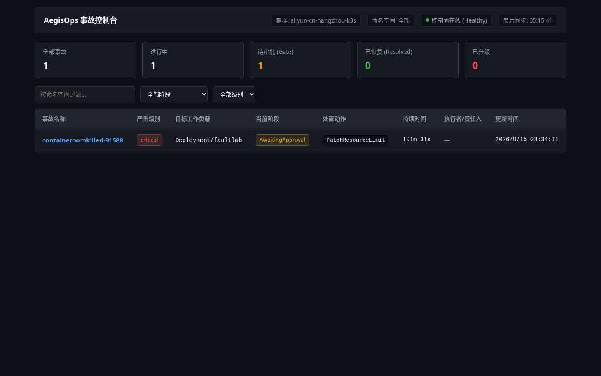
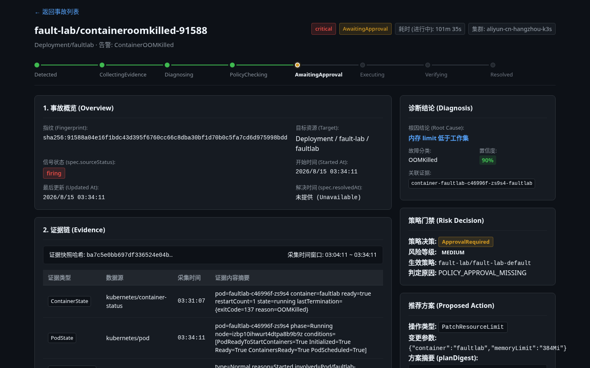
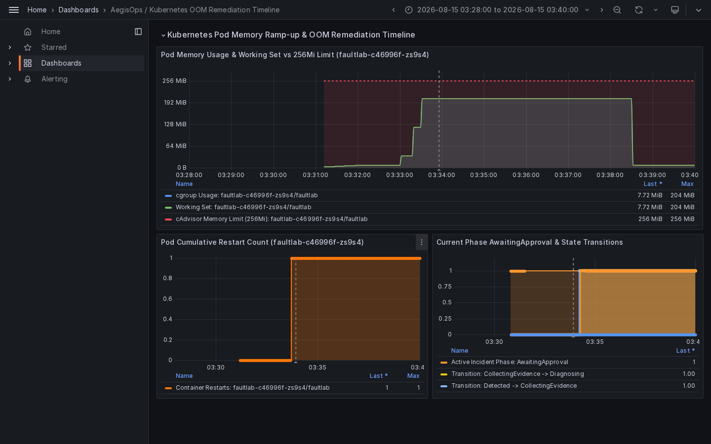
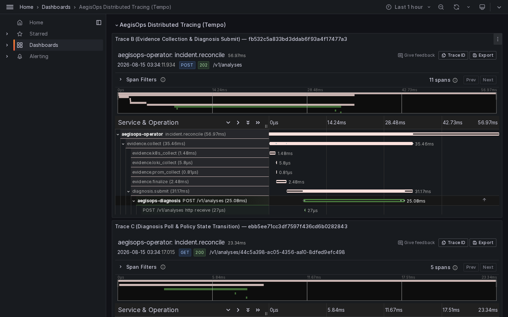
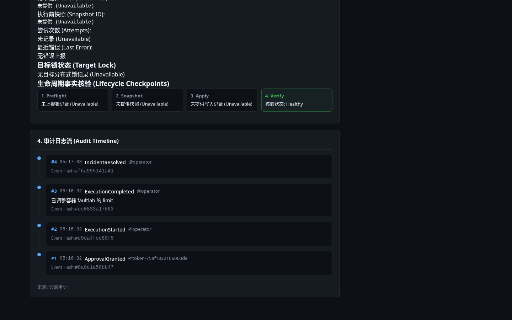
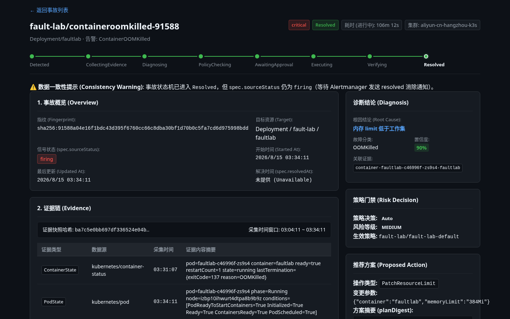

把大模型的自然语言直接喂给 `kubectl` 执行自动修复，在生产环境中存在致命隐患：模型缺乏集群写权限边界、文本不可审计，且结构性幻觉无法通过提示词调优根除。

**AegisOps** 是一个**面向生产约束的可靠性工程控制面**，核心原则是**建议权与执行权彻底分离**。大模型仅基于不可篡改的证据快照生成符合结构化 Schema 的候选方案，无任何直接集群写权限；所有变更必须通过确定性策略门禁、不可复用的方案摘要审批（planDigest）与健康验证闭环。

> **实机演练声明**：本文 6 张图均截取自**阿里云杭州区真实单节点 k3s（v1.31.5+k3s1）上的受控 OOM 演练现场**。展示从真实故障注入、只读证据链采集、AI 诊断、确定性策略门禁、SRE 显式审批、类型化动作写入、健康核验到 `Resolved` 状态收敛的完整闭环。

---

## 1. 事故概览：控制面事故总览与状态机

在真实的 Kubernetes 生产环境中，警报风暴常常导致运维人员迷失在海量重复告警中。AegisOps 告警网关在接收到 Alertmanager 触发的 `ContainerOOMKilled` 告警后，首先根据指纹进行防风暴收敛，去重生成全局唯一的 `AIOpsIncident` 自定义资源。


_图 1：AegisOps 控制台事故列表。集群标识 `aliyun-cn-hangzhou-k3s`，清晰展示严重级别（critical）、目标工作负载（`Deployment/faultlab`）、当前所处阶段（`AwaitingApproval`）与推荐处置动作（`PatchResourceLimit`）。_

整个自愈过程由 Kubernetes CRD 状态机驱动，严格遵循单向递进的阶段转移：

```text
Detected → CollectingEvidence → Diagnosing → PolicyChecking → AwaitingApproval → Executing → Verifying → Resolved
```

---

## 2. 真实 OOM 故障注入与多源证据链采集

在 `fault-lab` 命名空间中，我对 `faultlab` 工作负载（内存限制 `256Mi`）注入了平缓内存爬升故障（每 5 秒分配并触碰 28MiB 物理页）。当容器内存工作集触碰 cgroup 限额时，Linux 内核立即终止进程并由 kubelet 记录退出事实。

Operator 的证据采集器（只读模式）迅速捕获多源不可变证据快照：
- **Kubernetes 核心证据**：`containerStatuses.lastState.terminated: {reason: "OOMKilled", exitCode: 137}`，累计重启次数跃迁为 1。
- **Kubernetes 事件**：容器拉取、启动及 PodReady 状态事件。
- **可观测性时序证据**：Prometheus 抓取的阶梯内存曲线与 cAdvisor 指标。


_图 2：AwaitingApproval 详情页。多源证据链清晰展示 OOMKilled（exitCode 137）与重启事实；AI 诊断给出置信度 90% 的“内存 limit 低于工作集”结论；推荐动作被确定性策略拦截，进入 `AwaitingApproval` 并锁定唯一的 `planDigest`。_

---

## 3. 旁路可观测性佐证：真实时序与分布式追踪

### ① Grafana 真实 OOM 处置时序

Prometheus 以 1–2 秒的高精采样率完整记录了事故发生前后的时序特征：


_图 3：真实阿里云 k3s OOM 故障窗口（固定窗口 03:28–03:40）。fault-lab 容器内存工作集与 cgroup Usage 阶梯爬升至采样峰值约 204 MiB，随后在 Kubernetes Evidence 记录的 `lastTermination.reason=OOMKilled / exitCode 137` 事故点后重启并回落至基线；Container Restarts Observed in Window 发生单次跃迁（0 → 1），AegisOps 自动完成证据采集、诊断与策略评估后安全停在 `AwaitingApproval` 待审批阶段。_

> **专业说明**：Prometheus 监控曲线采样峰值为 204 MiB；OOM 成立的法定直接证据是 Kubernetes 记录的 `lastTermination.reason=OOMKilled` 和 `exitCode=137`。由于 cgroup 瞬时突发超限触发内核杀死 PID 1 的过程发生在毫秒级，采样图真实反映了 Prometheus 抓取周期的客观物理表现。

### ② Tempo 跨组件分布式调用链追踪

AegisOps 内部全面打通 OpenTelemetry 分布式追踪，通过 `incident.name` 串联起全链路异步调用：


_图 4：AegisOps 分布式追踪（Tempo Trace 瀑布图）。按 `incident.name` 关联告警接入、Kubernetes/Prometheus/Loki 只读证据采集、诊断提交与状态轮询，展示 Operator 与 Diagnosis API 之间跨服务的真实 Span 阶梯与耗时分解（Trace B: 11 Spans / Trace C: 5 Spans）。_

---

## 4. 确定性策略门禁与不可复用的 planDigest 审批

允许大模型直接执行任意代码是系统灾难的根源。AegisOps 设立了两道坚不可摧的安全防线：

1. **确定性纯逻辑策略门禁（Policy Engine）**：
   - 严禁 LLM 决定“是否直接执行”。
   - 策略引擎依据工作负载类型与环境策略（`fault-lab/fault-lab-default`）计算风险。
   - `PatchResourceLimit` 属于 `medium` 中风险动作，必须强制升级为 `ApprovalRequired`。
2. **防重放、防篡改的 planDigest**：
   - 方案摘要哈希由以下字段严格联合计算：
     $$\text{planDigest} = \text{SHA256}(\text{Action} \parallel \text{Params} \parallel \text{TargetUID} \parallel \text{PolicyRef})$$
   - 任何针对目标 Deployment 或策略的非受控变更，都会立即导致 Digest 失效，杜绝审批漂移与重放攻击。

---

## 5. 人工审批授权与类型化动作（Typed Action）执行

SRE 运维专家登录 AegisOps 控制台，审查证据链、诊断报告与参数后，输入审批理由（`SRE核准: 批准扩大内存至384Mi以消除OOM`）并签署同意。

AegisOps Operator 的唯一写操作组件 `executor` 收到合法的 `RemediationApproval` 后，立即启动严格的五步生命周期：

1. **Preflight（前置检查）**：获取目标分布式排他锁（Lease），校验资源版本。
2. **Snapshot（快照留存）**：记录变更前内存配置（`256Mi`）以便回滚。
3. **Apply（类型化写入）**：仅通过严格受限的 Kubernetes API 调整 limits：
   ```json
   {
     "container": "faultlab",
     "memoryLimit": "384Mi"
   }
   ```
4. **Verify（健康核验）**：单次非阻塞探针检测，持续跟踪新 Pod 的 RollingUpdate 进度。
5. **Rollback（异常回滚）**：若新 Pod 发生 CrashLoop 或探针超时，自动回滚至 Snapshot 快照。

---

## 6. 健康核验、审计哈希链与 Resolved 状态收敛

在新 Pod 成功拉起并处于 `1/1 Running` 状态、探针连续返回成功后，Operator 将事故状态置为 `Resolved`，自愈闭环圆满完成。


_图 5：执行生命周期与审计日志流。展示经过 SRE 人工审批（#1 `ApprovalGranted`）、Operator 启动执行（#2 `ExecutionStarted`）、内存调整写入（#3 `ExecutionCompleted`）到最终恢复（#4 `IncidentResolved`）的完整审计事件流，每个事件均持有不可伪造的 `eventHash`。_


_图 6：最终 Resolved 状态详情页。状态机全部点亮（绿色闭环）；健康核验标记 `Healthy`；Deployment 内存上限已成功在集群中提升为 `384Mi`。_

---

## 7. 核心架构安全原则（Fail-Closed 模型）

AegisOps 将安全底线刻在架构设计中：**宁可自愈中断报警人工介入，绝不盲目放行潜在风险**。

```
                   +-----------------------------+
                   |  Alertmanager / Prometheus  |
                   +--------------+--------------+
                                  | (Webhook)
                                  v
+-----------------------------------------------------------------+
| AegisOps 控制面 (Kubernetes Operator)                           |
|                                                                 |
|  1. 证据采集器 (Read-Only)  --> 抓取 K8s / Prom / Loki 证据快照   |
|  2. 诊断客户端              --> 发送不可变证据给隔离诊断沙箱      |
|  3. 确定性策略引擎          --> 判定 Risk，计算 planDigest        |
|  4. 人工审批门禁            --> 校验 SRE 授权与签名一致性         |
|  5. 类型化执行器 (Executor) --> 唯一允许修改 Workload 的组件     |
|  6. 审计日志器 (Audit)      --> 落盘防篡改哈希链                  |
+-----------------------------------------------------------------+
```

- **物理读写隔离**：DeepSeek 与诊断服务运行于无 K8s 写权限沙箱，不挂载任何写凭据。
- **禁止自由代码生成**：LLM 仅能选择预定义的 5 个 Typed Action，从根源杜绝通用 Shell 注入。
- **Fail-Closed 兜底**：无匹配 Policy、证据不充分、审计写失败或核验超时，全部安全退出并升级人工。

---

## 8. 演练交付物哈希与复现指南

本篇博客引用的 6 张核心截图已固化至代码仓库，SHA-256 校验和如下：

| 文件名 | SHA-256 校验和 | 内容摘要 |
| :--- | :--- | :--- |
| `01-aegisops-incident-list.png` | `e7f4f7ea9053831a209ae1892b80e28e75aa650129ea3b56f43f035f88f37121` | 控制台事故总览与列表 |
| `02-aegisops-awaiting-approval.png` | `c9d427bdca6a0cdb61bbfe6403511626d0537e64ee7d3768bab582172ddde0ed` | AwaitingApproval 详情与 planDigest |
| `03-grafana-oom-timeline.png` | `d2ee41442031748747ee12a0336773bcfae6efc02447a30c77c80b5747b179f1` | 真实 50s 阶梯内存 OOM 时序 |
| `04-tempo-distributed-traces.png` | `f1daed2701b98e2ac87c852bb57cd04a57545fe8ce41655f19ec256946c1b671` | Tempo 分布式追踪瀑布图 |
| `05-aegisops-execution-audit.png` | `c71ef2a059d9711680828963747c1a72232403160df19ab9a333bbc4e9084ecb` | 执行闭环与连续审计日志流 |
| `06-aegisops-resolved-overview.png` | `68957788dd71e584954bc712a574e78420d92cc8e02654cc7819dc40c5058fe5` | Resolved 最终恢复态与验证 |

### 本地沙箱一键复现

```bash
# 1. 克隆开源仓库并完成工具链校验
git clone https://github.com/user27c/aegisops.git && cd aegisops
make verify

# 2. 启动本地 Kind 沙箱与全量可观测性栈
scripts/dev-up.sh --context kind-aegisops-dev --profile full

# 3. 运行受控 OOM 故障自愈测试套件
make test-envtest
```

- **开源仓库**：[GitHub - user27c/aegisops](https://github.com/user27c/aegisops)
- **设计蓝图**：[docs/design/aegisops-implementation-blueprint.md](https://github.com/user27c/aegisops/blob/main/docs/design/aegisops-implementation-blueprint.md)
