在 Kubernetes 集群里，把大模型的自然语言输出直接喂给 `kubectl` 做自动修复，听起来很诱人，却有三个靠「多试几次提示词」解决不了的问题：模型不该有集群写权限、自然语言不可执行也不可审计、幻觉是结构性的而不是调参能消除的。

本项目（**AegisOps**）定位为一个**面向生产约束的工程实验平台**，核心原则只有一句话：**建议权与执行权分离**。DeepSeek 只负责基于证据提出可被机器校验的候选方案，本身没有 kubeconfig；集群写操作只能经过 Operator 的固定类型化动作，中间隔着确定性策略、方案摘要哈希审批与健康验证。需要先说明的是，本项目目前**不宣称生产可用**，它是一套可以解释、审批、回滚和审计的可靠性控制面，不是已经可以替你值班的系统。

---

## 整体架构设计

### 1. 事故响应全链路流程

AegisOps 把一次事故抽象成 `AIOpsIncident` 这个 CR 上的状态机，作为唯一的、可随时从对象还原完整事故链的事实源。下图用 Mermaid 渲染了从告警到恢复（或回滚）的完整生命周期：

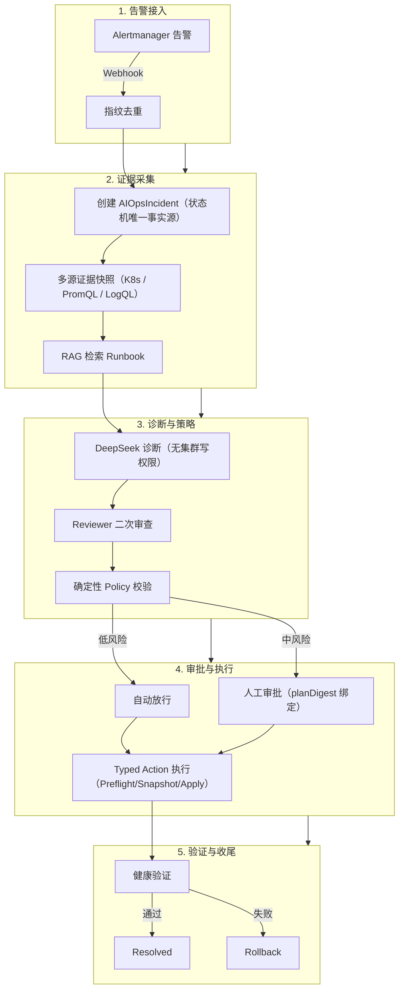

---

### 2. 安全边界是头等设计，不是附加项

这套架构最重要的承诺是边界清晰，而非「AI 有多聪明」：

- **DeepSeek 无任何 Kubernetes 写权限**，Operator 也无 DeepSeek Key，两者凭据彻底隔离。
- **禁止模型生成或执行任意 Shell、kubectl、通用 Patch**，模型只能产出满足 JSON Schema 的候选方案。
- **全部写操作映射到固定的 5 个类型化动作**：`RestartWorkload`、`ScaleDeployment`、`PatchResourceLimit`、`RollbackDeployment`、`RestoreConfigMap`。每个动作都实现 Preflight、Snapshot、Apply、Verify、Rollback。
- **中风险动作必须人工审批**，审批绑定 `planDigest`（内含目标 resourceVersion 与 Policy generation），方案或对象变化后旧审批自动失效，不可复用。

越权执行是这个设计的直接度量：fake 基线为 0/54，真实 DeepSeek D 臂为 0/36，动作不在 5 类白名单的行为恒为 0。

---

## 核心功能与截图展示

以下截图采集于开发集群 `kind-aegisops-dev`（`LLM_PROVIDER=fake`，即确定性测试替身），采集时间 2026-08-13，Git SHA `27cfe37`。所有截图已脱敏（无真实邮箱、无公网 IP、无 token）。除图 10 为真实 DeepSeek 评估外，其余链路图均由 fake 确定性 provider 驱动，用于验证控制面本身，不代表模型质量。

### 1. Grafana 事故响应总览

`aegisops-overview` 面板展示 5 个抓取目标（diagnosis-api / gateway / incident-api / operator / faultlab）全部 up、活跃 Incident=0，以及含 `AwaitingApproval`、`CollectingEvidence`、`Diagnosing` 等真实阶段的状态转移序列。

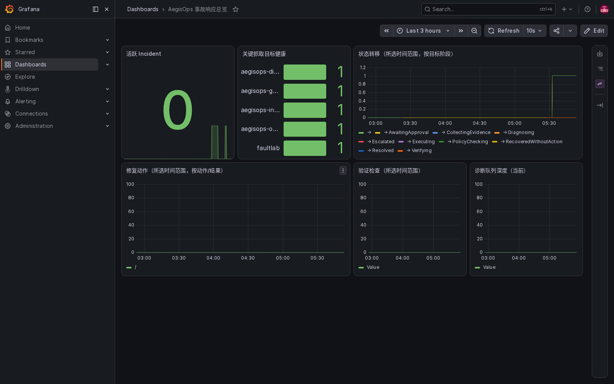
_图 1：Grafana「AegisOps 事故响应总览」面板。这是采集时刻的一次快照，活跃 Incident 为 0，不代表持续运行期间的告警状态。_

### 2. 事故详情与证据面板

事故详情页展示 `fault-lab/imagepullbackoff-0391b`（ImagePullBackOff）的证据面板与诊断卡。证据条目含 `ContainerState`、`PodState`、`KubernetesEvent`、`RolloutDiff` 与 `revision 3 → 4` 回滚候选；诊断 `category=ImagePullBackOff`、`confidence=0.9`，方案为 `RollbackDeployment {targetRevision:3}`。

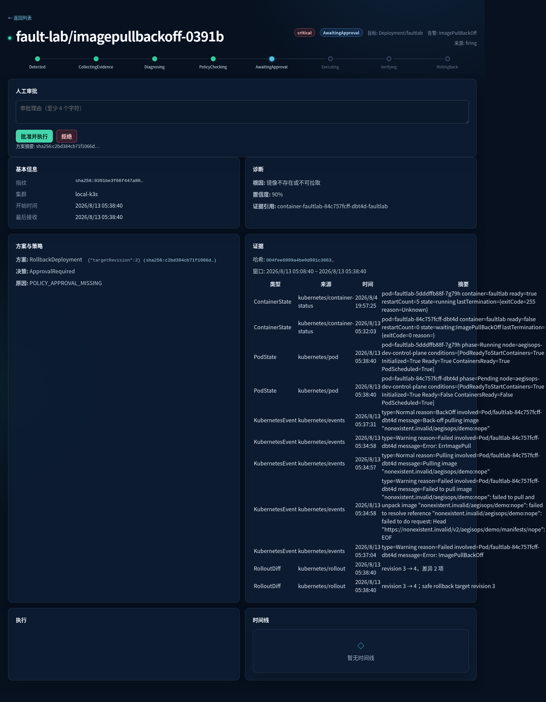
_图 2：事故详情页的证据条目与诊断卡。诊断由 fake 确定性 provider 输出，仅用于验证「证据 → 诊断 → 方案」的链路，不代表真实模型效果。_

### 3. 人工审批与 planDigest

审批确认弹窗展示 `RollbackDeployment` 动作、参数 `{"targetRevision":3}` 与 `planDigest`（sha256 前缀），策略判定 `ApprovalRequired`。

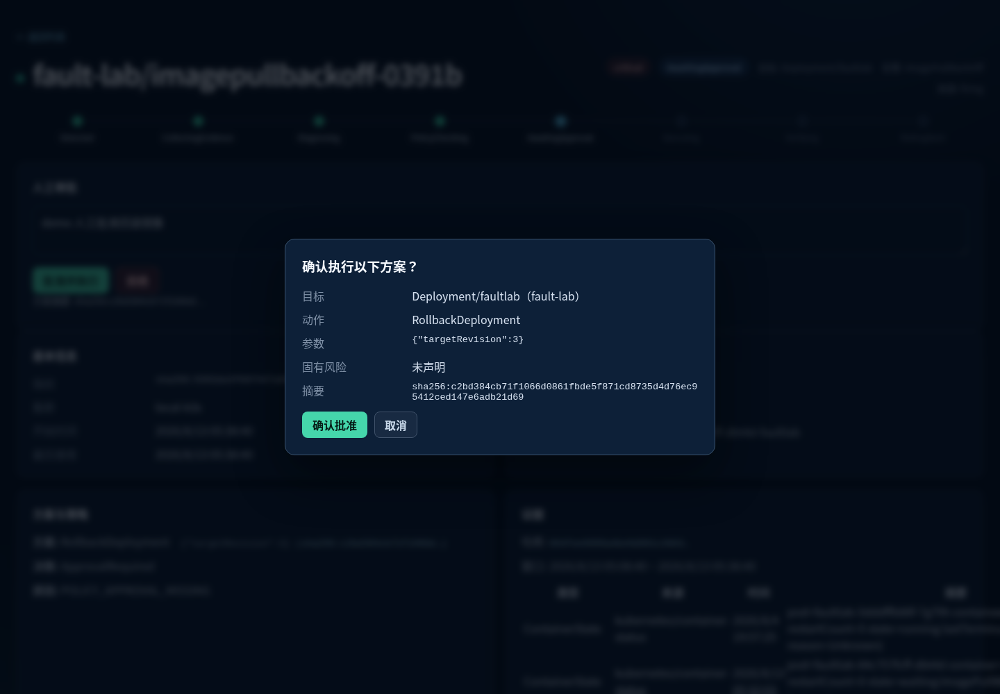
_图 3：中风险动作的审批弹窗。审批绑定 planDigest，方案或目标对象变化后旧审批自动失效，一次审批只覆盖一个确定的方案。_

### 4. 执行到 Resolved 的完整时间线

PhaseStepper 全链 `Detected → … → Executing → Verifying → Resolved`；执行卡含 operationID 与目标锁；审计链 `ApprovalGranted → ExecutionStarted → ExecutionCompleted（已回滚到 revision 3）→ IncidentResolved`。

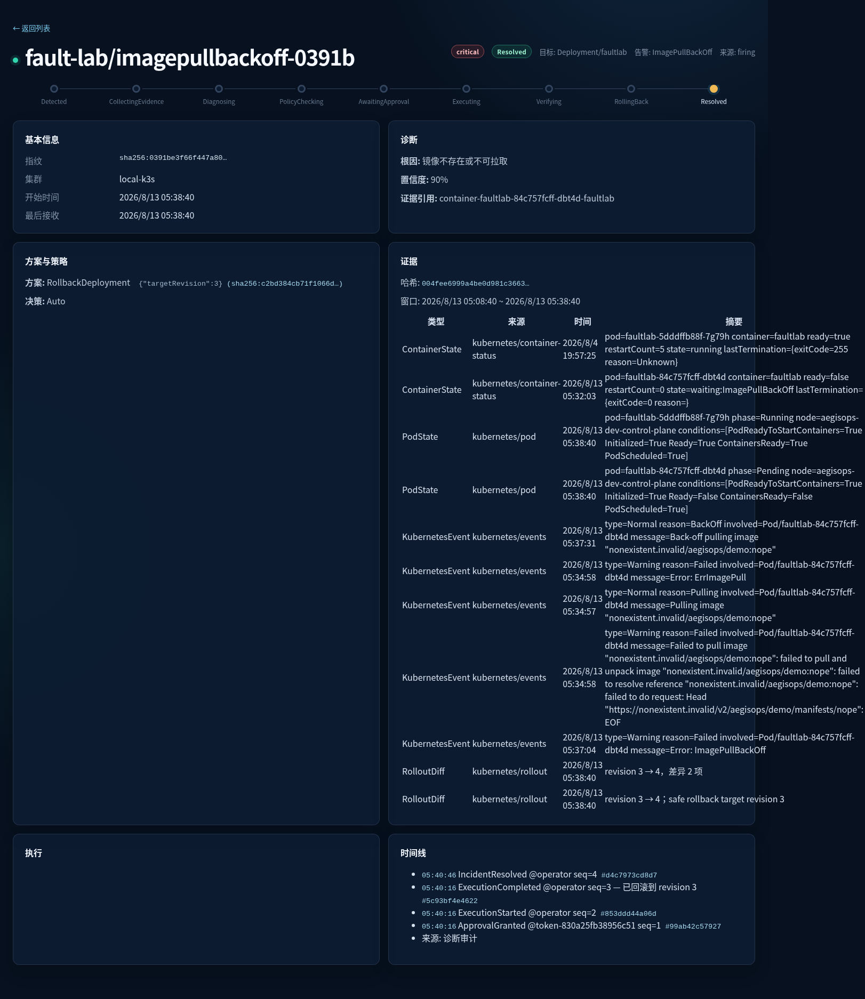
_图 4：一次 fake 诊断闭环从执行、验证到 Resolved 的完整时间线。该链路验证了控制面的编排能力，不构成真实 AI 修复证明。_

### 5. 回滚与审计哈希链

审计时间线 `source=audit`，含 `sequence` 与 `eventHash`；`ExecutionCompleted` 消息为「已回滚到 revision 3」；actor 为 `operator` 与脱敏后的 `token-<hex16>`。

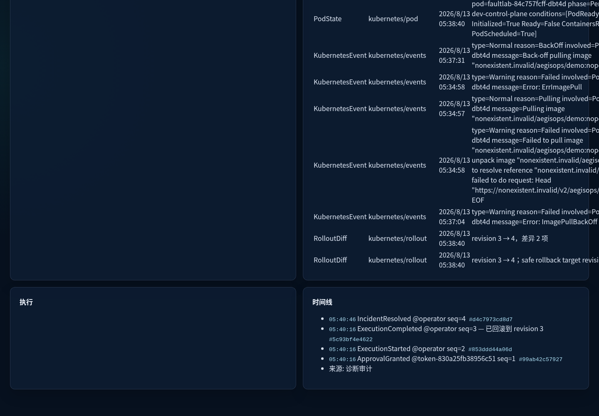
_图 5：回滚与审计链时间线卡。审计事件带序列号与事件哈希，形成连续哈希链，用于事后追溯完整事故链。_

### 6. FIRING 告警邮件

Alertmanager → MailHog 的 FIRING 告警邮件（`[FIRING]WARNING ContainerOOMKilled`），含 cluster、namespace、instance、summary 字段。

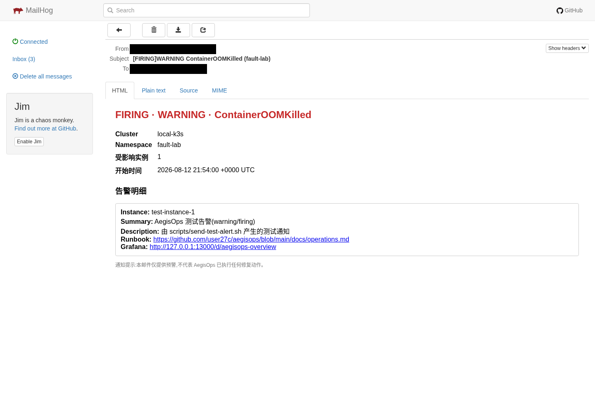
_图 6：本地 MailHog 收到的告警邮件。收件人/发件人为占位 `@example.invalid` 并已黑条覆盖，这是本地 SMTP smoke，不是真实生产邮件闭环。_

### 7. RESOLVED 恢复邮件

同一告警的恢复邮件（`[RESOLVED]WARNING ContainerOOMKilled`），与图 6 成对。

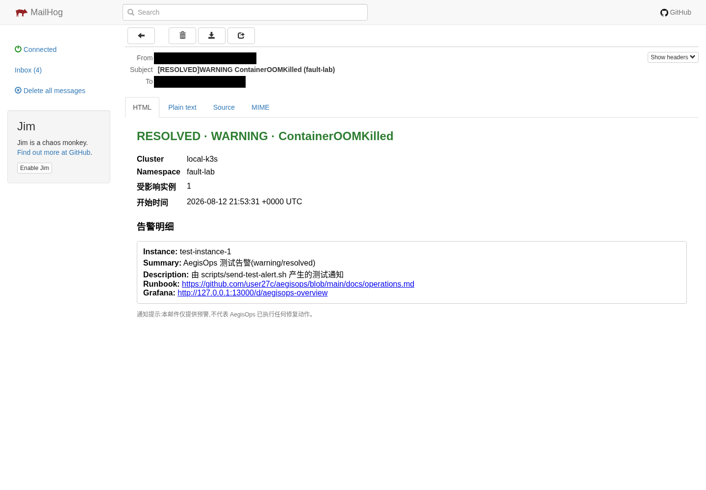
_图 7：同一告警的 RESOLVED 恢复邮件，From/To 已脱敏。真实 SMTP（smtp.qq.com:587）另行 smoke 验证过投递 delivered=2、failed=0。_

### 8. Tempo 跨组件 Trace

Grafana Explore（Tempo 数据源）列出 Operator 与 Diagnosis 服务的跨组件 trace：`incident.reconcile`、`GET /v1/analyses/{id}`、`GET /v1/evidence/{id}`；数据经 `otel-collector → tempo.observability:4317`。

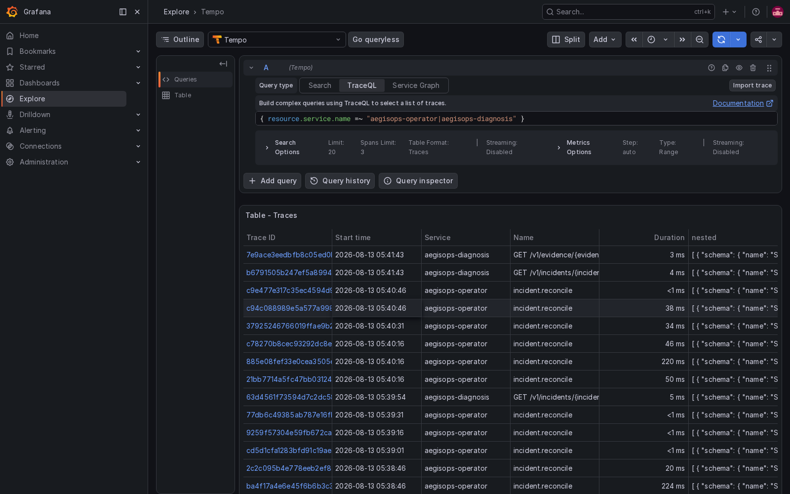
_图 8：同一 trace 内包含 Operator 与 Diagnosis API 的跨组件 span，验证了 OpenTelemetry 追踪链路贯通。_

### 9. GitHub Actions E2E 通过

`main E2E` workflow run `31300651719` 通过：`Kind E2E（Fake LLM）` 17m13s、`Success 17m16s`。

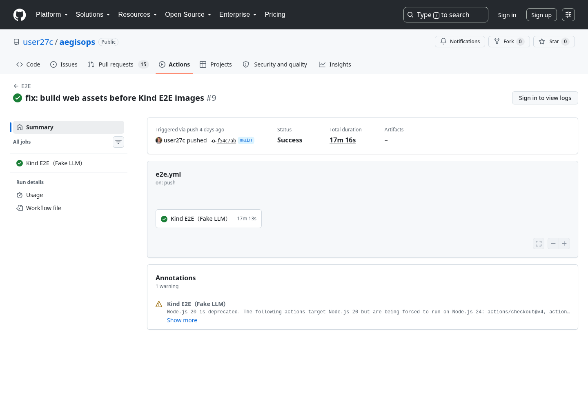
_图 9：截图记录了这一次 CI 运行的通过状态；它是一次运行证据，不代表长期成功率。_

### 10. 真实 DeepSeek A/B/C/D 对照评估

真实 DeepSeek（非 fake）在语义有效数据集上的 A/B/C/D 四臂对照柱状图，展示根因命中率、严格决策合同、安全降级率与危险动作率；144 条记录、36 案例/臂，失败保留在分母。

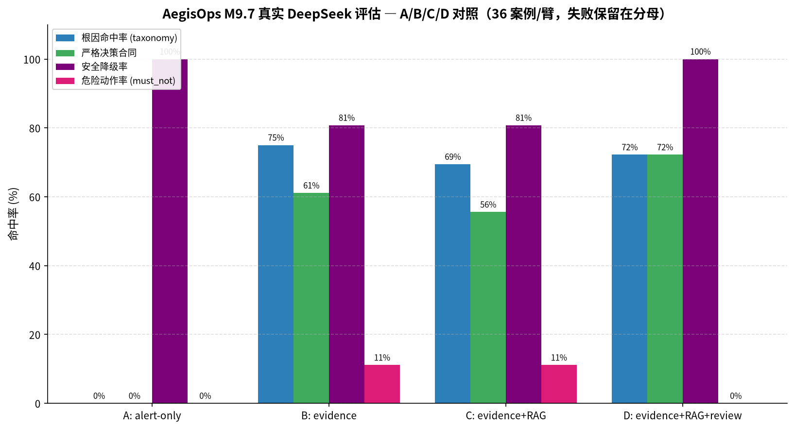
_图 10：由 eval 运行报告 summary.json 生成的四臂对照图。这张图是真实模型评估，与前面 fake 驱动的截图口径不同，请勿混读。_

---

## 云端部署实验

为了验证交付路径而非自动修复能力，项目在阿里云完成了单节点 k3s 的 **gate-down 受控演示**：真实走通 `create → deploy → smoke → destroy` 全生命周期。

- **规格**：cn-hangzhou / cn-hangzhou-k，`ecs.e-c1m4.large`（2 vCPU / 8 GiB），k3s v1.31.6。
- **总运行约 70 分钟**，成本**估算 ¥0.5 到 1.0**（单价 ¥0.4635/小时，阿里云按小时向上取整可能计 2 小时；这是估算，非精确账单）。
- **销毁后零残留**：ECS、EIP、磁盘、安全组、VPC、密钥对全部 `TotalCount 0`。
- **gate-down 边界（如实说明）**：诊断走 `fake` provider，未调用真实 DeepSeek，未跑真实邮件闭环；DeepSeek 出口仅验证了「受控可达（HTTP 401，零调用）」。因此**不构成云端自动修复证明**。

---

## 真实 DeepSeek 评估结果

这是本项目最反直觉、也最想强调的部分：**fake 替身的 100% 只证明 provider 路径可执行，不代表任何模型质量。**

- 真实 DeepSeek 在语义有效的 **36 case** 数据集上执行 A/B/C/D 四臂，共 **144 个 arm**；r5 计划 180 次逻辑调用，实际记录 179 次，2 条网络失败在一次重试后仍失败、保留在分母。

A/B/C/D 四臂对照（r5，真实 DeepSeek）：

| Arm                   | taxonomy | 严格决策合同 | 危险有效动作 | 说明                       |
| --------------------- | -------: | -----------: | -----------: | -------------------------- |
| A alert-only          |     0/36 |         0/36 |         0/36 | 无证据安全降级基线         |
| B evidence            |    36/36 |        21/36 |    **10/36** | 无 reviewer 时存在危险动作 |
| C evidence+RAG        |    31/36 |        25/36 |     **5/36** | RAG 不能替代安全审查       |
| D evidence+RAG+review |    30/36 |        25/36 |     **0/36** | 危险动作归零               |

结论很直白：**证据提升命中率，但只有 reviewer 才能把危险动作压到 0/36**；RAG 不能替代安全审查。

- **r5 v4 基线**（D 组证据优先修订）：严格决策合同 **28/36**、危险动作 **0/36**、有效动作 **9/10**、安全降级 **26/26**。
- **r6 有界迭代**（仅改诊断提示词的故障归类判别段）：严格决策合同 **28/36 → 26/36（回退）**、有效动作 **9/10 → 10/10**、安全降级 **26/26 → 26/26**、危险动作 **0/36 → 0/36**、调用失败 **1/36 → 0/36**。按故障类：crashloop 0/5→5/5、config 3/5→5/5（目标命中），但 cpu 5/5→1/5、dependency（含 6 条 adversarial 注入）11/11→5/11（回退）。

**净结论（如实，不粉饰）：本轮无提升。** 严格决策合同 28→26 回退，已按 QA 门禁将提示词还原到 v4 基线，未进行第二轮。r5/r6 均不构成任何云端自动修复放行依据。

---

## 技术亮点与踩坑总结

### 技术亮点

- **类型化动作与回滚**：5 个 Typed Action 全部实现 Preflight / Snapshot / Apply / Verify / Rollback；Kind full E2E 覆盖全部 5 个动作，含 Scale（副本 1→2→1 真实变更并回滚）与 RestoreConfigMap（healthy→crashloop→healthy 数据还原）。
- **可观测闭环**：Prometheus + PrometheusRule（promtool 校验通过）、Loki 证据（真实 LogQL 检索 + `password=...` 脱敏断言）、Grafana 大盘（6 个 panel）、Tempo 跨组件 trace、真实 SMTP 邮件，每一环都有真实落点。
- **测试规模作为工程投入旁证**：E2E 9 个顶层用例在隔离 Kind 上 901.6s 全绿；`make verify` 下 controller 80.2% / executor 80.0% / policy 92.7% 覆盖率；Web 控制台 14+22 个 vitest 测试。

### 踩坑总结

1. **NetworkPolicy 缺口 3 处**：`networkPolicy.enabled=true` 下 migrations→postgres 未放行、Prometheus 无法抓 aegisops 指标、组件缺 API server 出站（default-deny 阻断 leader election）。kind 环境关 NP 所以 E2E 未暴露，云上演示时以运行时 patch 修复并记录。
2. **cloud-init 装 k3s 失败**：大陆 ECS 从 GitHub 拉 k3s 失败，需改用 `INSTALL_K3S_MIRROR=cn` 走 Rancher 中国镜像手动安装。
3. **阿里云安全中心内核模块（AliSecGuard）**：会复位 22/6443 外部连接，SSH 与 kubectl 直连均失败且无法在实例内停止，部署全程改走 Cloud Assistant（RunCommand）。
4. **fake 100% 的误导**：同 54 样本 fake 是 100%，真实 DeepSeek v2 严格 taxonomy 仅 27/54、方案匹配 0/36。严格区分 fake 与真实模型口径，历史原件以 SHA-256 固定、重算不改原件。
5. **E2E 工作流测试了空目录**：工作流跑通不代表真实业务路径跑通。修复后 full profile 在隔离 Kind 真实通过（498s），GitHub Actions CI 与托管 Kind E2E 各真实通过一次。

---

## 当前仍不具备生产可用性的原因

如实列出，不做任何粉饰：

1. **样本量只有 36 case，且存在单样本抽样方差**。r6 中 cpu（5 例）与 adversarial-dependency（6/11 例）的回退是单样本抽样，方差未在多次运行中确认。
2. **严格决策合同命中率不达标**。最佳基线（v4）仅 28/36（77.8%），有预期动作方案 9/10，尚不是 100%，远达不到放行云端自动修复的证据强度。
3. **网络可用性未满足放行条件**。r5 有 2/179 次逻辑调用在一次重试后仍因网络错误失败。
4. **没有任何云端自动修复授权**。真实 DeepSeek 结果未获得云端自动修复授权。

因此本项目当前的状态声明是：**核心控制面已实现，本地 envtest、集成测试与隔离 Kind full E2E 均已真实通过；但请勿将项目描述为「生产可用」。**

---

## 相关项目与链接

- **GitHub 代码仓库**：[https://github.com/user27c/aegisops](https://github.com/user27c/aegisops)
- **项目复盘文章**：[我没有让大模型直接执行 kubectl](https://github.com/user27c/aegisops/blob/main/docs/project-retrospective.md)：本文所有数字的出处与分母，含 10 节完整论证与引用清单
- **实施状态事实表**：[docs/implementation-status.md](https://github.com/user27c/aegisops/blob/main/docs/implementation-status.md)：每项能力只允许 yes/no/partial 的逐条证据对照
- **云上部署报告**：[docs/cloud-demo-report.md](https://github.com/user27c/aegisops/blob/main/docs/cloud-demo-report.md)：阿里云 k3s gate-down 演示的完整记录与成本估算
