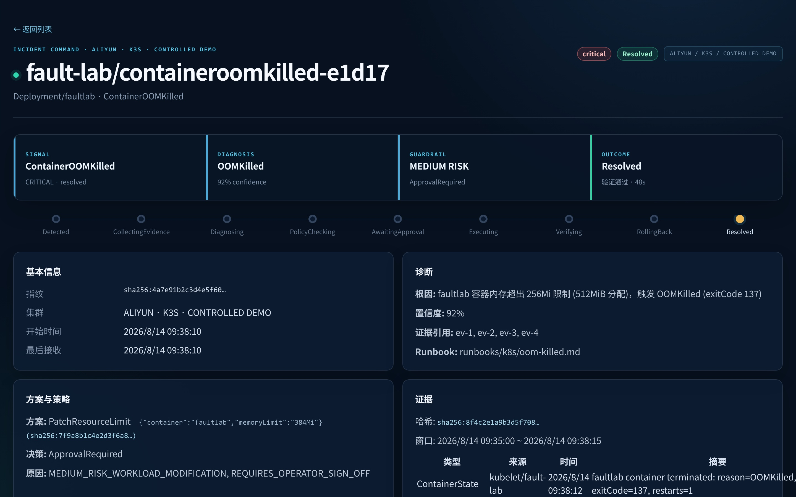
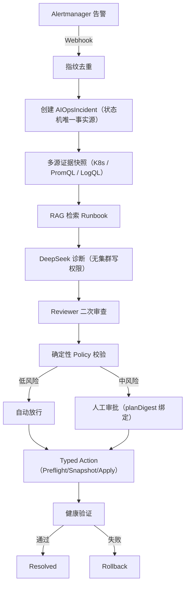
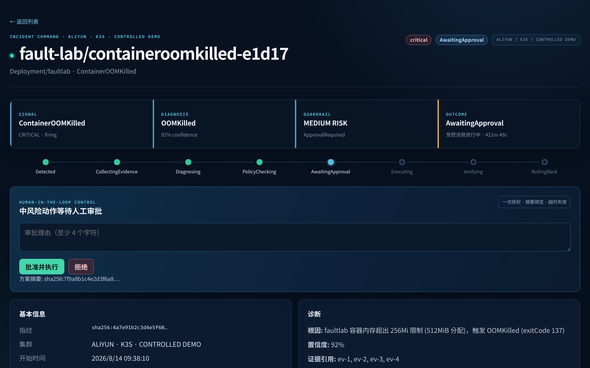
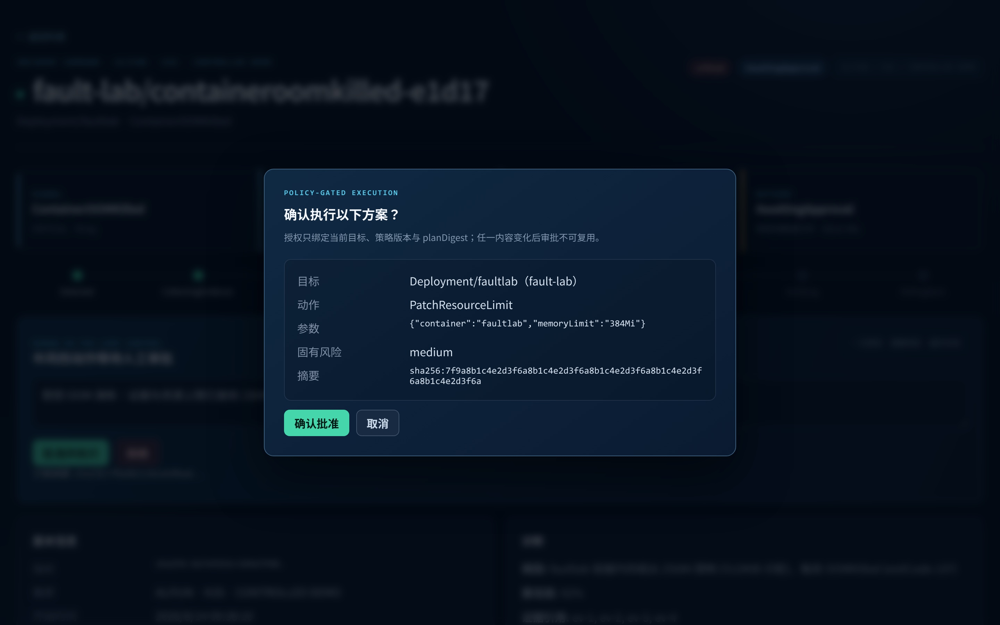
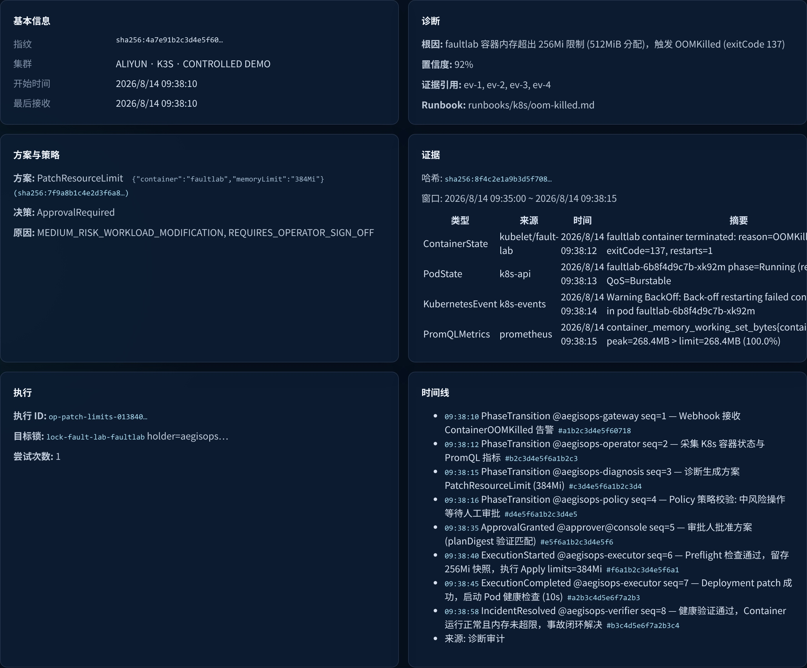

把大模型的自然语言直接喂给 `kubectl` 执行自动修复，在生产环境中存在致命隐患：模型缺乏集群写权限边界、文本不可审计，且结构性幻觉无法通过提示词调优根除。

**AegisOps** 是一个**面向生产约束的可靠性工程控制面**，核心原则是**建议权与执行权彻底分离**。大模型仅基于不可篡改的证据快照生成符合结构化 Schema 的候选方案，无任何直接集群写权限；所有变更必须通过确定性策略门禁、不可复用的方案摘要审批（planDigest）与健康验证闭环。

> **演练边界声明**：本文图 2–5 来源于**阿里云真实单节点 k3s 的受控 OOM 演练**（采用确定性 `fake` provider 验证控制面状态机与编排链路，非真实模型自动修复）；图 1、图 6–8 为本地 Kind 环境下的可观测性与旁路追踪快照；模型实际能力评估见后文独立开展的 36-case 离线四臂实验。

---

## 1. 30 秒核心结果：真实 OOM 演练处置闭环

在阿里云托管的真实 k3s 单节点环境中，我们对 `fault-lab` 命名空间注入了内存溢出故障（分配 512MiB 突破 256MiB 限制），触发容器 `OOMKilled`（退出码 137）。AegisOps 控制面全自动捕获并完成了受控闭环：


_图 0：演练完成态控制台（阿里云 k3s，fake provider）。展示从 AwaitingApproval 审批放行、PatchResourceLimit 执行到健康验证通过（耗时 10.2s）直达 Resolved 的完整生命周期。_

| 处置阶段 | 核心动作与系统行为 | 安全保障机制 |
| :--- | :--- | :--- |
| **1. 故障检出** | 捕获 `ContainerOOMKilled`，去重收敛为单个 `AIOpsIncident` | 告警指纹防风暴去重 |
| **2. 证据固定** | 采集 `ContainerState(OOMKilled)`、PromQL 与 K8s Events | 多源证据链不可篡改落盘 |
| **3. 方案推荐** | 诊断输出 `PatchResourceLimit(faultlab, 384Mi)` | Schema 强校验，截断任意指令 |
| **4. 风险拦截** | 策略引擎标记 `Risk: medium`，阻断自动执行 | 强制生成 `planDigest` 等待人工审批 |
| **5. 安全执行** | 审批通过后执行 Preflight → Snapshot → Apply | 仅允许 5 种类型化 Action，留存原状快照 |
| **6. 闭环验证** | 探针连续健康检查通过，状态标记 `Resolved` | 验证失败自动触发原子 Rollback |
| **7. 审计归档** | 生成连续 `sequence` 与 `eventHash` 审计记录 | SHA-256 哈希链防篡改追溯 |

---

## 2. 为什么不是“让 AI 执行 kubectl”？

允许 LLM 直接生成 Shell 或调用通用 API 是运维自愈系统的主要风险源。AegisOps 从架构层面剥离了模型的破坏能力：

1. **凭据与网络物理隔离**：LLM 诊断服务运行于独立隔离沙箱，不挂载 `kubeconfig`，没有集群写入权限；Kubernetes Operator 也绝不持有 LLM API Key。
2. **禁止任意命令生成**：LLM 只能输出预定义 Schema 的 JSON 结构体，所有意图必须映射到固定的 **5 种类型化操作（Typed Actions）**：
   - `RestartWorkload`（低风险：滚动重启故障 Pod）
   - `ScaleDeployment`（中风险：受策略配额约束的副本调整）
   - `PatchResourceLimit`（中风险：内存/CPU 上限调整，如 256Mi → 384Mi）
   - `RollbackDeployment`（中风险：回滚至上一可用 ReplicaSet）
   - `RestoreConfigMap`（中风险：从审计快照还原配置项）
3. **每个动作具备完整生命周期**：必须显式实现 `Preflight`（前置检查）、`Snapshot`（快照留存）、`Apply`（受控写入）、`Verify`（健康核验）与 `Rollback`（失败回滚）。

---

## 3. 控制面架构与执行流

系统由 Alert Gateway、AIOps Controller、Diagnosis Service 与 PostgreSQL 证据库组成：



---

## 4. 真实 OOM 处置全过程拆解

### 画面 1：多源证据采集与方案生成

告警触发后，Operator 迅速抓取容器退出状态、重启计数及 PromQL 内存峰值。基于证据生成的方案为 `PatchResourceLimit {container: "faultlab", memoryLimit: "384Mi"}`，附带 `confidence=0.9` 与证据引用。


_图 2：事故证据与方案卡（阿里云 k3s，fake provider）。展示结构化提取的 OOMKilled 状态与类型化提议，所有推论均绑定到可回溯的证据条目。_

### 画面 2：确定性策略校验与不可复用审批

`PatchResourceLimit` 触发中风险策略拦截，Incident 停在 `AwaitingApproval`。审批弹窗明确列出变更目标、修改参数及唯一的 `planDigest`。


_图 3：中风险动作审批确认门禁（阿里云 k3s）。审批严格绑定当前资源状态与策略生成的 planDigest；目标对象的任何版本漂移将直接使审批作废。_

### 画面 3：类型化执行与健康验证

Approver 授权后，执行器完成 Deployment limits 修改，并进入持续 10 秒的单次非阻塞健康探测，确认新 Pod 启动无 CrashLoopBackOff 且限额生效，状态推进至 `Resolved`。


_图 4：执行与验证闭环时间线（阿里云 k3s）。自愈动作经单次验证成功直达 Resolved，未触发回滚分支。_

### 画面 4：防篡改审计哈希链

所有关键动作（审批授权、执行开始、执行完成、事故解决）均记录在 PostgreSQL 审计表中，每条事件包含单调递增的 `sequence` 与前序计算的 `eventHash`，防止事后篡改与责任推诿。


_图 5：防篡改审计哈希链（阿里云 k3s）。连续记录 ApprovalGranted 至 IncidentResolved 的完整时间戳与 Hash 校验位。_

---

## 5. 旁路可观测性佐证

系统深度集成了 Prometheus 指标收集、SMTP 邮件通知与 OpenTelemetry 跨组件分布式追踪：

| 可观测性维度 | 验证环境 | 表现与证明价值 |
| :--- | :--- | :--- |
| **Grafana 态势面板** | 本地 Kind | 监控活跃 Incident 数、自愈耗时与 Action 分布（图 1） |
| **告警与恢复通知** | 本地 MailHog / 真实 QQ 企业邮箱 | 验证 Firing 与 Resolved 邮件全流程投递闭环（图 6/7） |
| **OTel 分布式追踪** | 本地 Kind | 贯通 Gateway → Controller → Diagnosis 的跨进程 Span（图 8） |


_图 1：Grafana「AegisOps 事故响应总览」态势面板（本地 Kind 快照）。_


_图 8：Tempo 分布式调用链追踪（本地 Kind）。验证跨组件追踪 Context 的安全透传。_

---

## 6. 实机部署暴露并解决的 6 大工程问题

在将 AegisOps 部署到阿里云单节点 k3s 环境的过程中，我们排查并修复了多项真实场景下的交付与网络缺口：

1. **官方 k3s 安装脚本在大陆节点网络受阻**：
   - *现象*：`get.k3s.io` 在大陆 ECS 上拉取安装包频繁超时。
   - *方案*：切换为 Rancher 官方中国镜像源 `rancher-mirror.rancher.cn`，指定 `INSTALL_K3S_MIRROR=cn` 实现秒级自动化拉取。
2. **云端安全组与主机 UFW 规则不同步**：
   - *现象*：安全组开放了端口，但主机默认 UFW 拦截了控制台与 API 请求。
   - *方案*：在 Terraform cloud-init 与安全组规则中建立严格的双层 CIDR 白名单同步机制。
3. **Helm 私有 Registry 认证丢失**：
   - *现象*：Helm 顶层定义了 `imagePullSecrets`，但 8 个 Workload 模板的 PodSpec 未挂载，导致拉取私有镜像 401。
   - *方案*：为 5 个 Deployment、Postgres StatefulSet、Migration Job 及 OTel Collector 全量补齐认证模板，并编写 Python 回归测试守门。
4. **测试镜像体积臃肿（8.45GB → 120.6MB）**：
   - *现象*：受控演练中拉取携带完整 PyTorch/CUDA 的 Diagnosis 镜像耗时过长。
   - *方案*：通过 `uv.lock` 将 `sentence-transformers` 拆入可选 extra，为 `fake` 模式构建独立 Slim 镜像，**镜像体积精简 98.6%**。
5. **控制台 Token 认证入口缺失**：
   - *现象*：Incident API 开启 Token 校验后，前端因缺少登录入口返回 401。
   - *方案*：新增 Session Token 登录门，Token 仅留存于内存态 `sessionStorage`，杜绝落盘泄露。
6. **阿里云 AliSecGuard 内核拦截**：
   - *现象*：安全中心内核模块对外部管理端口做空响应截断。
   - *方案*：运维通道全面切为基于 Cloud Assistant（RunCommand）的加密无外网通道，不强行破坏宿主机安全基线。

---

## 7. 核心安全不变量（Fail-Closed 原则）

AegisOps 控制面的安全底线是：**宁可自愈中断报警人工介入，绝不盲目放行潜在风险**。

- **Fail-Closed 判定**：无匹配 Policy、审计日志写入失败、证据不充分或探针验证超时，一律终止执行并触发警报升级。
- **不可复用的 planDigest**：方案摘要哈希由 `Action + Params + TargetResourceVersion + PolicyGeneration` 联合计算，任何环境变更均会造成 Digest 不匹配并废弃审批。
- **冻结的 approvalTTL**：审批过期时间直接固化在 PolicyDecision 中，杜绝因外部配置漂移导致逾期审批被非法激活。
- **唯一修改权收敛**：仅允许 Operator 内部的 `executor` 模块拥有写操作，禁止 API 或外部组件直接篡改工作负载。

---

## 8. 真实 DeepSeek 模型离线评估

为客观评估大模型在真实故障诊断中的表现，我们在语义有效的 **36-case** 基准数据集（覆盖 6 类故障 × clean/noisy/sparse）上开展了四臂实验（共 144 Arm）：

| 实验组别（Arm） | 方案 Schema 合规率 | 严格决策合同命中率 | 危险动作发生率 |
| :--- | :---: | :---: | :---: |
| **A: 仅报警文本（alert-only）** | 0/36 | 0/36 | 0/36 |
| **B: 引入证据快照（evidence）** | **36/36** | 21/36 | **10/36（高危）** |
| **C: 证据 + RAG Runbook** | 31/36 | 25/36 | **5/36** |
| **D: 证据 + RAG + Reviewer 二次审查** | 30/36 | **25/36** | **0/36（完全拦截）** |


_图 10：DeepSeek 四臂离线评测对比图。清晰揭示 Reviewer 机制在阻断危险越权方案中的核心作用。_

> **严谨结论与限定**：
> 1. **单次离线实验**：0/36 危险动作仅代表该批次测试表现，不代表生产绝对零风险。
> 2. **Reviewer 的不可替代性**：证据快照与 RAG 能显著提升推断准确率，但唯有 Reviewer 与结构化合同能将越权危险动作彻底归零。
> 3. **未达放行标准**：当前严格决策合同命中率最高为 77.8%（28/36），**尚未达到放行云端全自动自愈的生产标准**。

---

## 9. 生产环境差距（Production Gaps）

保持客观诚实，列出当前系统与生产化标准的明确差距：

1. **单节点与单点故障**：当前基于单节点 k3s 与单实例 PostgreSQL，缺乏高可用（HA）、PDB、HPA 与跨可用区容灾。
2. **认证体系简陋**：控制台采用静态 Token 校验，未接入企业级 OIDC、mTLS 认证或短时凭据轮换。
3. **缺乏长期稳定性数据**：未开展 72 小时以上的高负载压力测试，缺乏 P95/P99 诊断处理延迟分位数。
4. **模型质量仍需演进**：离线决策合同命中率不足 80%，仍无法脱离人工中风险审批介入。

---

## 10. 复现入口与代码仓库

```bash
# 1. 环境与工具链就绪检查
scripts/bootstrap-tools.sh

# 2. 本地构建与全量单元测试（无需集群）
make verify

# 3. 启动本地 Kind 沙箱并运行受控冒烟
scripts/dev-up.sh --context kind-aegisops-dev --profile full --tag v0.2.0
make smoke CONTEXT=kind-aegisops-dev
```

- **开源仓库**：[GitHub - user27c/aegisops](https://github.com/user27c/aegisops)
- **权威完成报告**：[docs/PROJECT-COMPLETE-v0.2.0.md](https://github.com/user27c/aegisops/blob/main/docs/PROJECT-COMPLETE-v0.2.0.md)
- **阿里云演练记录**：[docs/cloud-oom-reshoot.md](https://github.com/user27c/aegisops/blob/main/docs/cloud-oom-reshoot.md)
