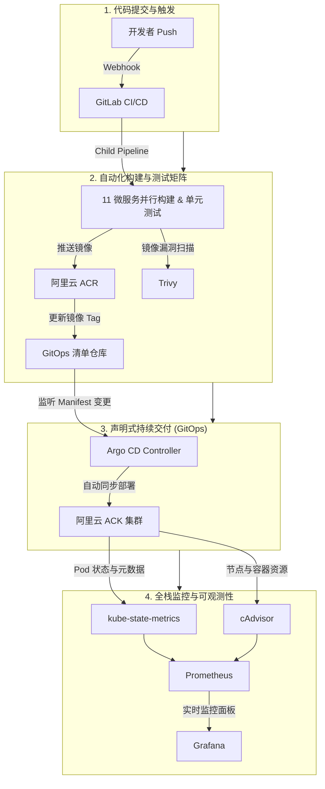

在云原生微服务架构下，随着服务数量的增长，如何保障多语言微服务构建的快速迭代、自动化代码质量校验、透明安全的 GitOps 交付以及全方位的集群与业务指标监控，是企业级 DevOps & SRE 团队的核心挑战。

本项目（**Aliyun K8s CI/CD & Observability Lab**）定位为云原生交付与可观测性实验平台。部署的核心业务负载是 Google Cloud 官方开源的 **[Online Boutique (microservices-demo)](https://github.com/GoogleCloudPlatform/microservices-demo)** —— 一套由 11 个多语言微服务组成的演示应用。本项目以此为基准工作负载，在 **阿里云 ACK 托管 Kubernetes 集群** 与 **ACR 镜像服务**上验证 CI/CD、GitOps 和监控链路。

[查看源码仓库](https://github.com/user27c/aliyun-k8s-cicd-lab) · [上游微服务 Demo](https://github.com/GoogleCloudPlatform/microservices-demo)

| 核心维度 | 关键技术选型与实现 |
| --- | --- |
| **基础设施** | 阿里云 ACK (托管 Kubernetes 集群) + ACR 镜像服务 |
| **CI 构建矩阵** | GitLab CI 动态 Child Pipeline、Trivy 容器安全扫描、多服务并发构建 |
| **GitOps 交付** | 声明式 GitOps 仓库、Argo CD 自动同步与健康状态拓扑管理 |
| **可观测体系** | Prometheus 算力指标采集、kube-state-metrics、Grafana 细粒度监控大盘 |
| **基准负载** | Online Boutique (11 个多语言微服务：Go, Node.js, Python, Java, C#, .NET) |

---

## 1. 端到端 GitOps 交付架构与数据流转

系统基于声明式 GitOps 理念构建，以下通过 Mermaid 展现从代码提交、并行构建、安全扫描、镜像推送，到清单同步与全栈指标观测的端到端数据流与拓扑结构：

---

## 2. 核心功能与控制台实操展示

### A. GitLab CI/CD 流水线运行记录
在 GitLab CI 中实现了基于服务变更路径感知的动态 Child Pipeline，仅针对被修改的服务进行精准构建与单元测试，构建成功后将最新 Commit SHA 镜像 Tag 安全推送到阿里云 ACR 并回写 GitOps 清单。

*图 1：GitLab 流水线运行记录，展示多语言微服务并行构建与测试通过状态。*

---

### B. 在线精品电商微服务应用 (Online Boutique)
微服务应用包含 11 个跨多语言的微服务（包含 Frontend、CartService、OrderService 等），通过负载均衡对外暴露服务入口。

*图 2：部署于 ACK 集群上的在线精品电商 (Online Boutique) 业务前端渲染界面。*

---

### C. Argo CD 声明式 GitOps 持续部署与健康拓扑
通过 Argo CD 控制器实时追踪 GitOps 仓库的配置，当检测到最新镜像 Tag 变更时自动按声明式 API 将部署同步至 ACK 集群中，并自动维护拓扑状态。

*图 3：Argo CD 控制台呈现 `online-boutique` 应用处于 Healthy 与 Synced 稳定状态，右侧展开各微服务 Deployment、ReplicaSet 与 Pod 的健康拓扑树。*

---

### D. 全栈云原生监控与可视化面板 (Grafana + Prometheus)

#### 1) 阿里云 ACK 节点与物理资源大盘 (Cluster & Node Overview)
- 实时监控 ACK 物理节点总数 (6)、集群运行中 Pod 总数 (123)、CPU 核心使用量平滑曲线、内存消耗以及 Node Network I/O 实时吞吐。

*图 4：Grafana 集群节点物理资源与网络流量监控大盘。*

#### 2) Kubernetes Pods & 核心微服务细粒度大盘
- 依托 `kube-state-metrics` 与 cAdvisor，展现 Pod CPU 消耗 Top 10、Pod 内存占用、采样时刻的 Pod 状态分布以及容器重启频次。

*图 5：Grafana Kubernetes Pod 容器组细粒度消耗与状态大盘。*

---

## 3. 常见踩坑与技术攻坚总结

1. **GitOps 清单并发推送被拒与安全凭据管理 (`non-fast-forward push rejection`)**：
   - **解法**：摒弃存在覆盖风险的 `git push --force` 强推，在 CI 脚本中配置带重试功能的 `git fetch` + `git rebase` 环路机制；凭据完全托管在 GitLab CI/CD Variable 中（Masked & Protected），杜绝硬编码泄漏。
2. **Kube-State-Metrics 指标缺失与面板 No Data 修复**：
   - **解法**：部署兼容国内镜像源的 `kube-state-metrics` 实例，并为其注入 `release: kube-prometheus-stack` 的全局 `ServiceMonitor` 关联，打通 Pod 状态流。
3. **Prometheus PV 拓扑等待锁 (WaitForFirstConsumer)**：
   - **实验取舍**：在 ACK 轻量环境中将 Prometheus TSDB 临时切换为 `emptyDir`，绕过存储绑定问题并加快启动。该方案在 Pod 重建时会丢失历史数据，不属于高可用或生产持久化方案。

---

## 4. 系统全景概念图 (AI 辅助生成)

为更直观地呈现云原生实验平台在整体交付各阶段的逻辑分层，下图补充展示了基于阿里云 ACK 搭建的云原生 CI/CD 交付与可观测性概念全景：

*注：上图由 AI 辅助生成，概念化划分为四大核心板块：源码与 CI 构建矩阵（区域一）、GitOps 声明式交付（区域二）、ACK Kubernetes 微服务 Pods 拓扑（区域三）以及 Prometheus/Grafana 全栈可观测性体系（区域四）。*

---

## 相关项目与链接

- **GitHub 代码仓库**：[https://github.com/user27c/aliyun-k8s-cicd-lab](https://github.com/user27c/aliyun-k8s-cicd-lab)
- **上游部署应用**：[GoogleCloudPlatform/microservices-demo (Online Boutique)](https://github.com/GoogleCloudPlatform/microservices-demo) —— Google Cloud 官方开源的 11 微服务云原生电商演示应用，本项目的核心部署负载
