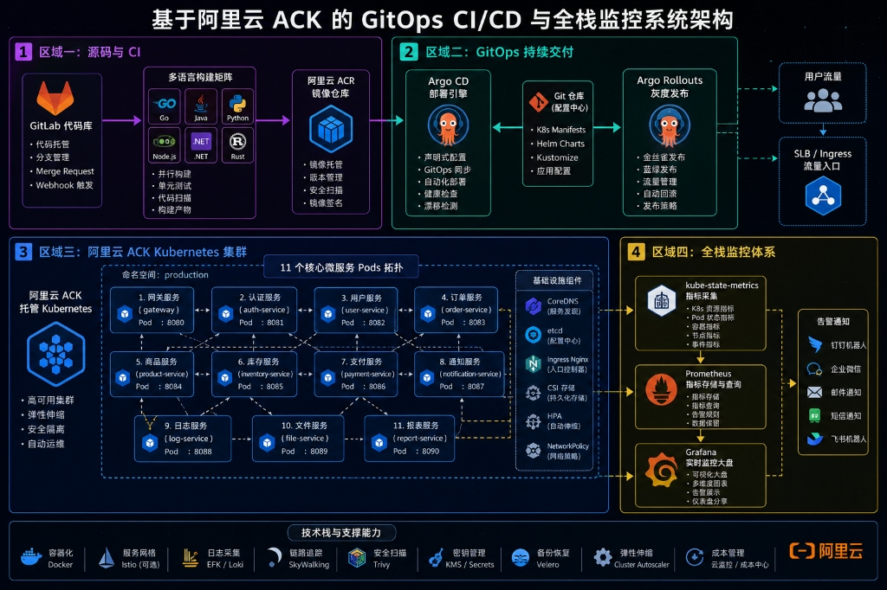
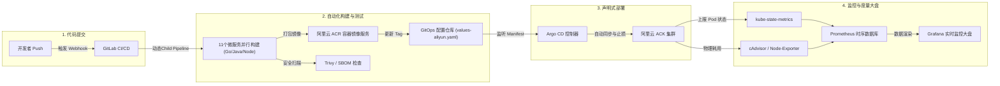
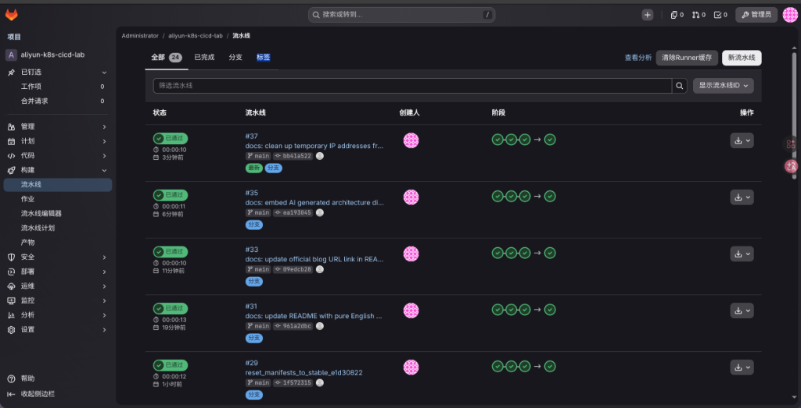
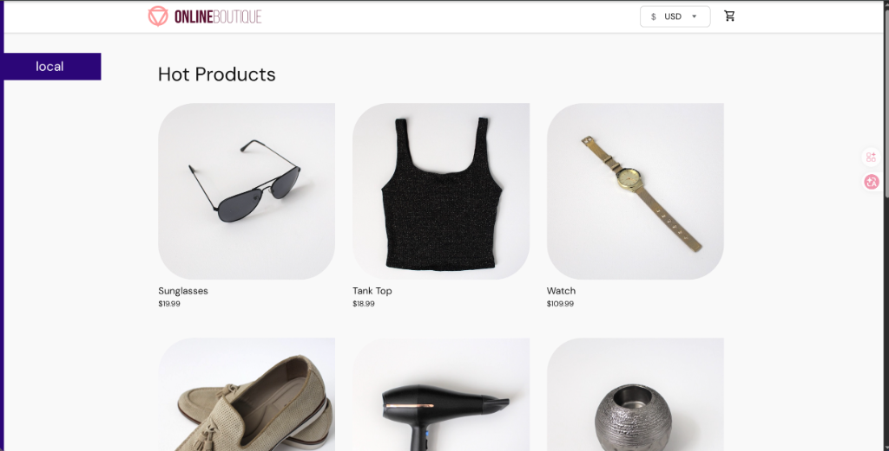
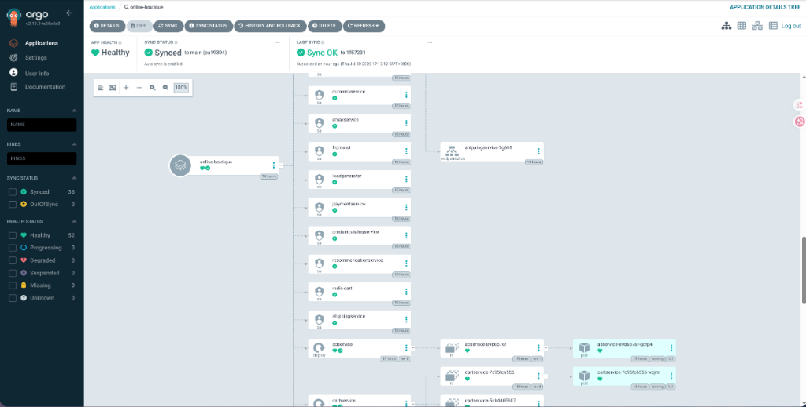
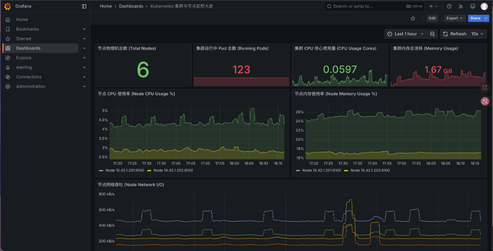
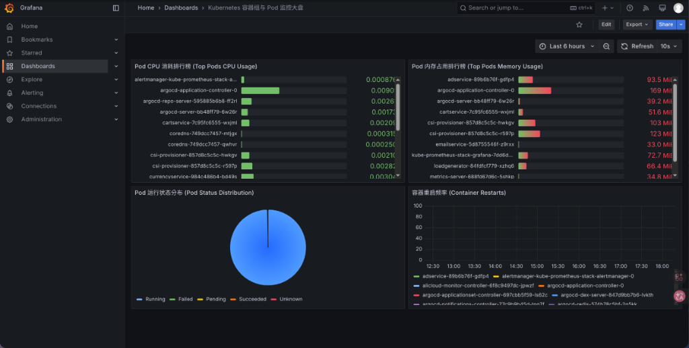

# 阿里云 ACK + ACR 企业级 GitOps CI/CD 与全栈可观测性工程落地

在云原生微服务架构下，随着服务数量的增长，如何保障多语言微服务构建的快速迭代、自动化代码质量校验、透明安全的 GitOps 交付以及全方位的集群与业务指标监控，是企业级 DevOps & SRE 团队的核心挑战。

本项目（**Aliyun K8s CI/CD & Observability Lab**）部署的核心业务负载是 Google Cloud 官方开源的 **[Online Boutique (microservices-demo)](https://github.com/GoogleCloudPlatform/microservices-demo)** —— 一套由 11 个多语言微服务（Go、Node.js、Python、Java、C#、.NET）组成的云原生电商平台演示应用。本项目以此为基准工作负载，基于 **阿里云 ACK 托管 Kubernetes 集群** 与 **ACR 镜像服务**，构建了一套完整的生产级自动化 CI/CD 与云原生可观测性解决方案。

---

## 整体架构设计

### 1. 系统模块与数据流拓扑图 (AI 辅助生成)

下图展示了基于阿里云 ACK 搭建的云原生 CI/CD 交付与可观测性全脉络：

*注：上图清晰划分为四大核心板块：源码与 CI 构建矩阵（区域一）、GitOps 声明式交付（区域二）、ACK Kubernetes 微服务 Pods 拓扑（区域三）以及 Prometheus/Grafana 全栈可观测性体系（区域四）。*

---

### 2. 端到端 GitOps 交付与数据流转 Markdown 示意图

为进一步厘清系统内部组件间的通信路径，以下使用 Markdown Mermaid 渲染了完整的数据流与逻辑流：

---

## 核心功能与控制台实操展示

### 1. GitLab CI/CD 100% 全绿流水线

在 GitLab CI 中实现了基于服务变更路径感知的动态 Child Pipeline，仅针对被修改的服务进行精准构建与单元测试，构建成功后将最新 Commit SHA 镜像 Tag 安全推送到阿里云 ACR 并回写 GitOps 清单。

*图 1：GitLab 流水线面板呈现近期所有的提交（如 #37、#35、#33、#31 等）均达到 100% 绿色通过状态。*

---

### 2. 在线精品电商微服务应用 (Online Boutique)

微服务应用包含 11 个跨多语言的微服务（包含 Frontend、CartService、OrderService 等），通过负载均衡对外暴露服务入口。

*图 2：部署于 ACK 集群上的在线精品电商 (Online Boutique) 业务前端渲染界面。*

---

### 3. Argo CD 声明式 GitOps 持续部署与健康拓扑

通过 Argo CD 控制器实时追踪 GitOps 仓库的配置，当检测到最新镜像 Tag 变更时自动按声明式 API 将部署同步至 ACK 集群中，并自动维护拓扑状态。

*图 3：Argo CD 控制台呈现 `online-boutique` 应用处于 Healthy 与 Synced 稳定状态，右侧展开各微服务 Deployment、ReplicaSet 与 Pod 的健康拓扑树。*

---

### 4. 全栈云原生监控与可视化面板 (Grafana + Prometheus)

#### A. 阿里云 ACK 节点与物理资源大盘 (Cluster & Node Overview)
- 实时监控 ACK 物理节点总数 (6)、集群运行中 Pod 总数 (123)、CPU 核心使用量平滑曲线、内存消耗以及 Node Network I/O 实时吞吐。

*图 4：Grafana 集群节点物理资源与网络流量监控大盘。*

#### B. Kubernetes Pods & 核心微服务细粒度大盘
- 依托 `kube-state-metrics` 与 cAdvisor，实时展现 Pod CPU 消耗 Top 10、Pod 内存占用排行榜、Pod 运行状态分布饼图（100% Running 绿色无故障）以及容器重启频次追踪。

*图 5：Grafana Kubernetes Pod 容器组细粒度消耗与状态大盘。*

---

## 常见踩坑与技术攻坚总结

1. **GitOps 清单并发推送被拒 (`non-fast-forward push rejection`)**：
   - **解法**：在 CI 脚本中配置强制 Rebase 策略及安全 Token 身份校验，确保矩阵并发阶段的 Manifest 更新零冲突。
2. **Kube-State-Metrics 指标缺失与面板 No Data 修复**：
   - **解法**：部署兼容国内镜像源的 `kube-state-metrics` 实例，并为其注入 `release: kube-prometheus-stack` 的全局 `ServiceMonitor` 关联，打通 Pod 状态流。
3. **Prometheus PV 拓扑等待锁 (WaitForFirstConsumer)**：
   - **解法**：在 ACK 轻量级环境中将 Prometheus TSDB 存储模式切换为轻量高可用的 `emptyDir` 内存/本地模式，实现 StatefulSet 毫秒级恢复启动。

---

## 相关项目与链接

- **GitHub 代码仓库**：[https://github.com/user27c/aliyun-k8s-cicd-lab](https://github.com/user27c/aliyun-k8s-cicd-lab)
- **上游部署应用**：[GoogleCloudPlatform/microservices-demo (Online Boutique)](https://github.com/GoogleCloudPlatform/microservices-demo) —— Google Cloud 官方开源的 11 微服务云原生电商演示应用，本项目的核心部署负载

